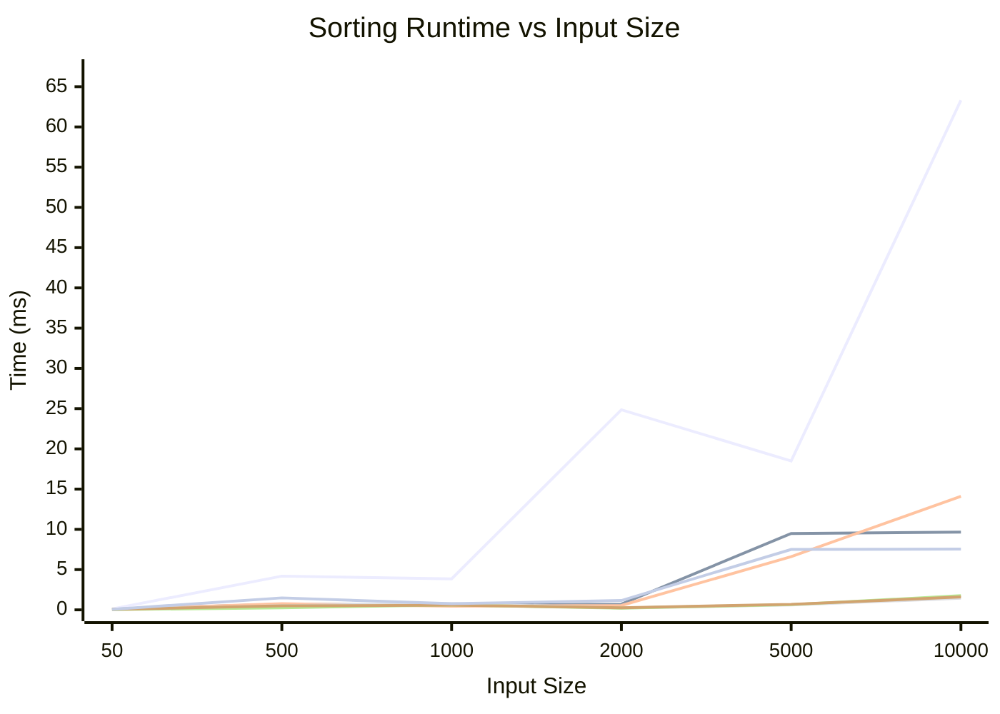

# DSA Assignment 3 - CSV Graphing

This project writes benchmark results to `results.csv` in this format:

- Header row: sorting algorithm names
- One row per input size, in order: `50, 500, 1000, 2000, 5000, 10000`
- Values are execution times in milliseconds

<!-- CHART:START -->

<!-- CHART:END -->

## Chart Key

- `Insertion`: insertion sort
- `Heap`: heap sort
- `Merge`: merge sort
- `Quick`: quick sort (cutoff `1`)
- `Quick10`: quick sort (cutoff `10`)
- `Quick50`: quick sort (cutoff `50`)
- `Quick200`: quick sort (cutoff `200`)